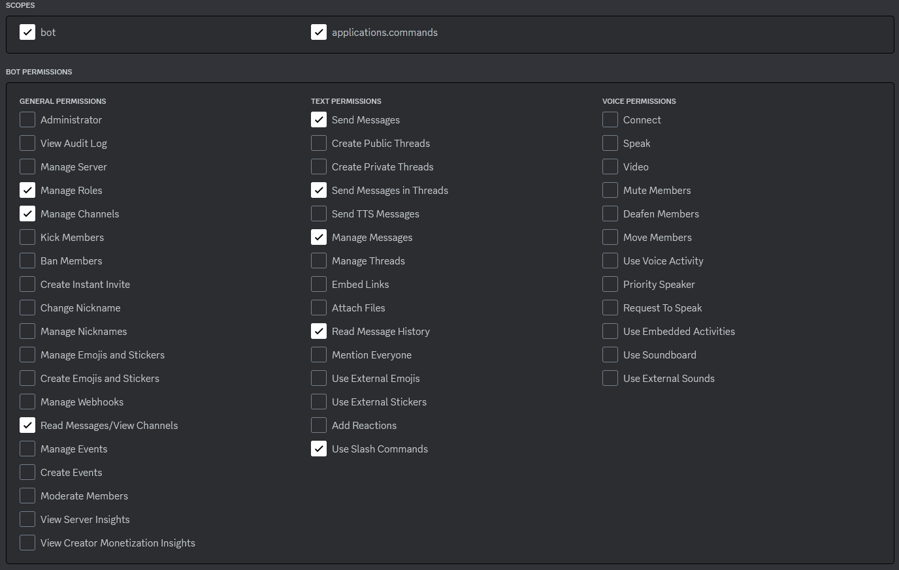

# Omega Strikers MainCord Bot

Allow Discord users to connect their Omega Strikers account with Discord by using this bot's slash commands.

# Prerequisites

- MySQL (any version should work but to be safe, I recommend 8.0)
- Go (version 1.2 or higher)

# How to setup

1. Visit https://discord.com/developers
2. Create a new Application (Top-right corner)
3. Go to "Bot" and allow all "Privileged Gateway Intents"
4. Go to OAuth2 -> General, set "Default Authorization Link" to "In-app Authorization" and select the following:

5. Go to OAuth2 -> URL Generator, select bot and applications.commands and select under bot permissions everything, which was selected during Step 4.
6. At the bottom you can find a generated link which you go to. It will ask, which server you want the bot to connect to and if the permissions are correct.
7. Copy the .env.sample file, rename it to ".env" and fill out all the Discord connection info as well as the Prometheus Authorization info you find in the there.
* discordtoken: Back on the Developers page -> Bot -> Token (just below the name). If you've never copied the token before, reset the token and copy it.
* discordguildid: Activate Developers mode in Discord and then rightclick the server where the bot joined. At the bottom you will find "Copy Server ID"
* discordauth2id: Developers page -> OAuth2 -> General and right under Client information you can find the Client ID.
* discordauth2secret: Right next to the Auth2ID, you can find the Secret. If you've never copied it before, you need to reset it.
* prometheusauth: jwt inside the identity.json
* prometheusrefreshtoken: refreshToken inside the identity.json
8. Now prepare the MySQL server. With the default settings in the .env, it should look like this:
```
CREATE DATABASE IF NOT EXISTS osmc;
CREATE USER 'osuser'@'localhost' IDENTIFIED BY 'ospassword';
GRANT USAGE ON *.* TO 'osuser'@'localhost' IDENTIFIED BY 'ospassword';
GRANT ALL PRIVILEGES ON osmc.* TO 'osuser'@'localhost';
FLUSH PRIVILEGES;
```
Do remember it needs to run parallel to the main program the whole time.

9. Start the main program. Open the terminal move to the main the directory and run
```
go run ./main
```

# todo

- implement pro league role